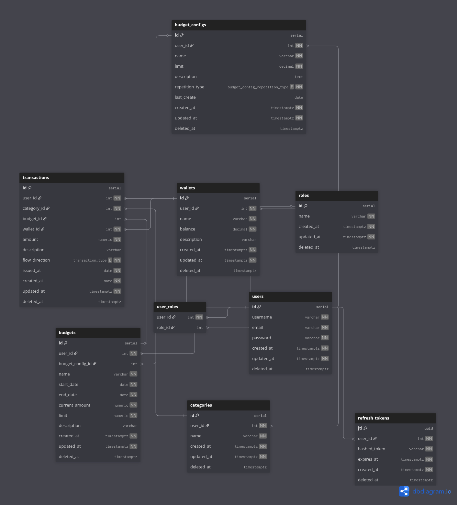

# Old Money

This is Budget

## ERD



## Tech Stack

- Axum
- SeaORM
- Swagger
- Argon2
- JWT

## Features

- Tracing
- Database Migration
- Request Compression & Decompression (gzip, deflate, br, zstd)
- Standardize Success, Paginated, and Error Response
- Authentication (JWT, RBAC, Refresh Token)
- Request Body Validation
- Proper Error Handling
- Environment Variables Management
- Swagger Documentation
- Graceful Shutdown

## How To Run

This application is dockerized and pushed into the docker hub with the name of leviis/old-money. You can either build
this application using docker `build command` or pull the image from docker hub. Make sure that the database is already
migrated. You can run use `sea-orm-cli` or `cargo` command to run the migration first

### Docker Run Command Example
```bash
docker container run \
-e ACCESS_TOKEN_EXPIRATION="300" \
-e DB_URI=<db-uri> \
-e JWT_SECRET=<jwt-secret> \
-e PORT=8080 \
-e REFRESH_TOKEN_EXPIRATION="2592000" \
-e RUST_LOG="info" \
-e TIMEOUT_DURATION="60" \
-p 8080:8080 \
-d \
--name old-money \
leviis/old-money:1.0.0
```
